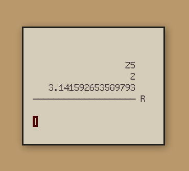

# basil

An RPN calculator with a simple terminal interface

</img>

**Commands:**

```
Pop off the stack: "pop", "p", "."
Swap: "swap", "s", ","
Push memory value to stack: "recall", "r", "]"
Set memory value: "store", "S", "["
Clear the stack: "clear", "c", ";" 
Switch between degrees and radians: "angle", "a", "<"
+
-
*
/
%
^
square
cube
sqrt
log
ln
logx
root
flip
sin
cos
tan
asin
acos
atan
fact
```

**Key bindings:**

```
ESC: Exit
```
